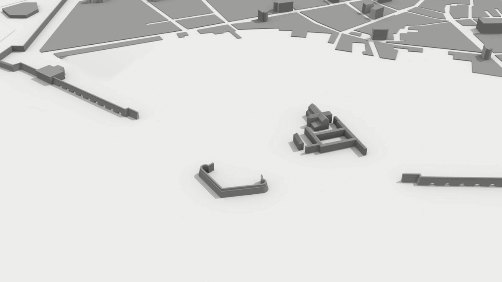

# potree-CHtemplate

An updated template for Potree pages based on [Vizcaya Museum](https://github.com/VizcayaMuseum/Kiosk) project and inspired by [potree-sfm](https://github.com/hokiespurs/potree-sfm) project features.

A working example can be found on the [LabMGF DICA PoliMi website](https://labmgf.dica.polimi.it/pujob/potree-template/).

")

Information about how the project was developed, including details on the survey campaign and on web platform implementation, can be found on the official documentation website.

## **Table of content** 📋

- [How to install and run](#how-to-install-and-run-⚙)
- [Features](#features-💡)
- [License](#license)
- [Performance](#performance-💻)
- [Credits](#credits-👥)
- [How to contribute](#how-to-contribute-❓)
- [Examples](#examples)

## **How to install and run** ⚙

Make sure you have the following installed and working in order to reproduce the project. You can view detailed installation guidelines within the following links:
* [Xampp / Apache server](https://www.apachefriends.org/index.html)
* [Github to clone project](https://git-scm.com/downloads)

[⚠ UNDER CONSTRUCTION]

## **Features** 💡
- Fullscreen HTML5 API
- Bootstrap integration
- Simplified navigation
- Accessible
- Informational overlays
- Slowed annotation camera rotations
- Animations from annotations
- Oriented images on the model

## **License**

For continuity sake, this project carries the same license as the original Potree project.

## **Performance** 💻
Examples work best and with Google Chrome and Firefox.

## **Credits** 👥

The project has been originally developed by **LAB2R** (Laboratory of Survey and Representation) coordinated by Professor [Livio Pinto](https://www.researchgate.net/profile/Livio-Pinto) at Politecnico di Milano - Piacenza campus.

The in situ survey was part of the laboratories for the [**RELIEF TECHNIQUE AND 3D MODELING FOR THE ARCHITECTURE**](https://www11.ceda.polimi.it/schedaincarico/schedaincarico/controller/scheda_pubblica/SchedaPublic.do?&evn_default=evento&c_classe=735710&polij_device_category=DESKTOP&__pj0=0&__pj1=93e89e7f2db93a52f4de53beb4e38ea2) course from the Bachelor of Science Degree in Architectural Design. Drone surveys and laser scanner acquisitions were conducted and pre-processed by [Federico Barbieri](https://www.linkedin.com/in/federico-barbieri-8006a0228/) and [Francesco Ioli](https://www.linkedin.com/in/francesco-ioli-640061160/)

The collected data were first processed within the research thesis project entitled *Riscoprire il gigante sommerso - Rilievo, indagine storica e ricostruzione digitale del Castello di Pierluigi Farnese by Michele Dondi and Clara Rivieri.* by Michele Dondi and Clara Rivieri.

The digital twin platform implementation was carried by [Federica Gaspari](https://www.linkedin.com/in/federicagaspari/).

[⚠ UNDER CONSTRUCTION]

## **How to contribute** ❓

[⚠ UNDER CONSTRUCTION]

## **Examples**

* [**Castello Farnese**](https://labmgf.dica.polimi.it/pujob/potree-template/) in Piacenza (Italy)
* [**Belvedere Glacier**](https://labmgf.dica.polimi.it/pujob/belvedere/) in Macugnaga (Italy)