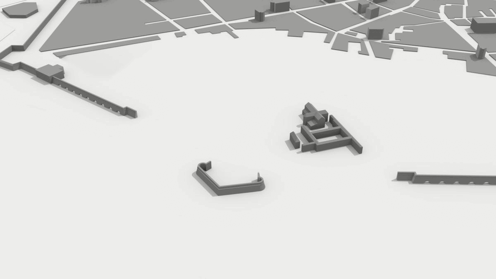

# potree-CHtemplate

An updated template for Potree pages based on [Vizcaya Museum](https://github.com/VizcayaMuseum/Kiosk) project and inspired by [potree-sfm](https://github.com/hokiespurs/potree-sfm) project features.

A working example can be found on the [LabMGF DICA PoliMi website](https://labmgf.dica.polimi.it/pujob/potree-template/).

")

Information about how the project was developed, including details on the survey campaign and on web platform implementation, can be found on the official documentation website.

## **Table of content** 📋

- [How to install and run](#how-to-install-and-run-⚙)
- [Features](#features-💡)
- [License](#license)
- [Performance](#performance-💻)
- [Credits](#credits-👥)
- [How to contribute](#how-to-contribute-❓)
- [Examples](#examples)
- [References](#references)

## **Overview**

potree-chtemplate extends the Potree WebGL point cloud viewer with specialized features for cultural heritage documentation. The template transforms multi-modal survey data (point clouds, photogrammetric models, oriented images) into an interactive web-accessible digital twin supporting both free exploration and guided narrative experiences.

### **Key features**

* *Dual-scene architecture* - Separate outdoor and indoor environments with seamless transitions
* *Interactive annotations* - 17 clickable hotspots with contextual multimedia content
* *Camera animations* - Guided tours through predefined navigation paths
* *Oriented images* - Photo overlays aligned with 3D geometry 
* *Historical phases* - Toggle between 9 construction evolution phases template-implementation.rst:23
* *Responsive design* - Bootstrap integration for mobile and desktop compatibility

## **How to install and run** ⚙

Make sure you have the following installed and working in order to reproduce the project. You can view detailed installation guidelines within the following links:
* [Xampp / Apache server](https://www.apachefriends.org/index.html)
* [Github to clone project](https://git-scm.com/downloads)

## **Data preparation**

1. Convert point clouds using PotreeConverter from LAS/LAZ to Potree JSON format
2. Place converted data in ./pointclouds/ directory
3. Configure loaders in JavaScript modules (loadpointclouds.js, loadannotations.js, etc.)

## **License**

For continuity sake, this project carries the same license as the original Potree project. More information can be found in the [LICENSE](https://github.com/Tars4815/potree-chtemplate/blob/main/LICENSE) file.

## **Performance** 💻
Examples work best and with Google Chrome and Firefox.

## **Credits** 👥

The project has been originally developed by **LAB2R** (Laboratory of Survey and Representation) and LabMGF (Geodetic and Photogrammetric Laboratory) coordinated by Professor [Livio Pinto](https://www.researchgate.net/profile/Livio-Pinto) at Politecnico di Milano - Piacenza campus.

The in situ survey was part of the laboratories for the [**RELIEF TECHNIQUE AND 3D MODELING FOR THE ARCHITECTURE**](https://www11.ceda.polimi.it/schedaincarico/schedaincarico/controller/scheda_pubblica/SchedaPublic.do?&evn_default=evento&c_classe=735710&polij_device_category=DESKTOP&__pj0=0&__pj1=93e89e7f2db93a52f4de53beb4e38ea2) course from the Bachelor of Science Degree in Architectural Design. Drone surveys and laser scanner acquisitions were conducted and pre-processed by [Federico Barbieri](https://www.linkedin.com/in/federico-barbieri-8006a0228/) and [Francesco Ioli](https://www.linkedin.com/in/francesco-ioli-640061160/)

The collected data were first processed within the research thesis project entitled *Riscoprire il gigante sommerso - Rilievo, indagine storica e ricostruzione digitale del Castello di Pierluigi Farnese by Michele Dondi and Clara Rivieri.* by Michele Dondi and Clara Rivieri.

The digital twin platform implementation was carried by [Federica Gaspari](https://www.linkedin.com/in/federicagaspari/).

## **Documentation**

Full documentation available at [potree-chtemplate.readthedocs.io](https://potree-chtemplate.readthedocs.io/en/latest/)

Topics covered:

* Template implementation guide
* Data acquisition methodology
* Survey techniques and processing workflow
* Customization instructions

## **How to contribute** ❓

if you are willing to contribute or test the template for several applications and report a bug or suggest new features:
1. Fork this repository
2. Clone your fork
3. Create a new branch
4. Make desired changes to the code and commit them
5. Push changes to your GitHub repository
6. Open a pull request

## **Examples**

* [**Castello Farnese**](https://labmgf.dica.polimi.it/pujob/potree-template/) in Piacenza (Italy)
* [**Belvedere Glacier**](https://labmgf.dica.polimi.it/pujob/belvedere/) in Macugnaga (Italy)

## **Acknowledgements** 

The project team thanks **Marcello Spigaroli** and **Ente Farnese** for the stimulating and exciting study opportunity and for the support on the historical investigation on the site. Moreover, we would like to acknowledge the collaboration demonstrated by the **Military Arsenal of Piacenza** and the **Historical Archives of Parma** in facilitating the research in the archives and libraries.

## References

### Publications

* Gaspari, F., Barbieri, F., Fascia, R., Ioli, F., Pinto, L. (2024) An Open-Source Web Platform for 3D Documentation and Storytelling of Hidden Cultural Heritage. *Heritage*, 7, 517-536. https://doi.org/10.3390/heritage7020025

* Gaspari, F., Ioli, F., Barbieri, F., Rivieri, C., Dondi, M., and Pinto, L.: Rediscoverinng cultural heritage sites by interactive 3D exploration: a practical review of open-source WebGL tools, *Int. Arch. Photogramm. Remote Sens. Spatial Inf. Sci.*, XLVIII-M-2-2023, 661–668, https://doi.org/10.5194/isprs-archives-XLVIII-M-2-2023-661-2023, 2023

### Presentations

* **CIPA 2023 Firenze** (28.06.2023) - *Rediscoverinng cultural heritage sites by interactive 3D exploration: a practical review of open-source WebGL tools by Federica Gaspari* ([SLIDES](https://app.cipa2023florence.org/wp-content/uploads/2023/06/03_GIS-WEBGIS-SHARING-INFORMATION-AND-3D-DATA-2_Gaspari.pptx.pdf))
