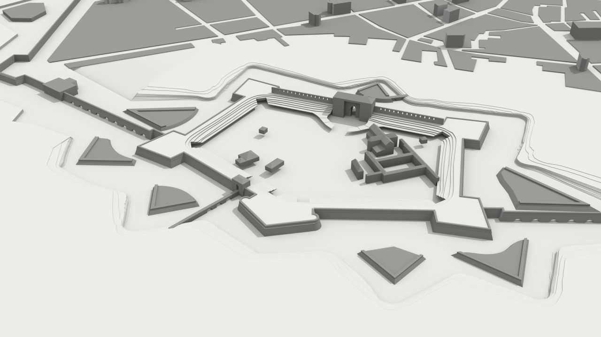

Introduction
==================

This documentation describes in details how the Potree basic viewer was customised in order to develop a dedicated web platform for the interactive exploration of the digital twin of the **Farnese Castle** located in Piacenza (Italy).

A working example of this project can be found on the Politecnico di Milano DICA `LabMGF website. <https://labmgf.dica.polimi.it/pujob/potree-template/>`__

Project Context
----------------

[TEXT]

Farnese Castle
--------------

The geometric reconstruction and digital representation has been applied for the case study of the **Farnese Castle**.
This pentagonal plan structure commissioned by Duke Pier Luigi Farnese in the XVI century is in the southern part of the city of Piacenza (Adorni B., 1889). Today it is the site of the Polo di Mantenimento Pesante Nord (former Military Arsenal).

.. raw:: html

	

		<iframe width="425" height="350" frameborder="0" scrolling="no" marginheight="0" marginwidth="0" src="https://www.openstreetmap.org/export/embed.html?bbox=9.666574001312258%2C45.04581423573891%2C9.694168567657472%2C45.05580428318172&amp;layer=mapnik&amp;marker=45.05080947757892%2C9.680371284484863" style="border: 1px solid black"></iframe> <small><a href="https://www.openstreetmap.org/?mlat=45.0508&amp;mlon=9.6804#map=16/45.0508/9.6804">View Larger Map</a></small>
	

The area consists in a surface of approximately 10 hectars. As a result of a process of dismantling portions of the castle during the XVIII century, only 3 of the original 5 ramparts are now visible together with one of the curtain walls.
Also, only two rampart indoor areas are accessible, containing an exhibition with documents and artifacts related to the history of Piacenza.

