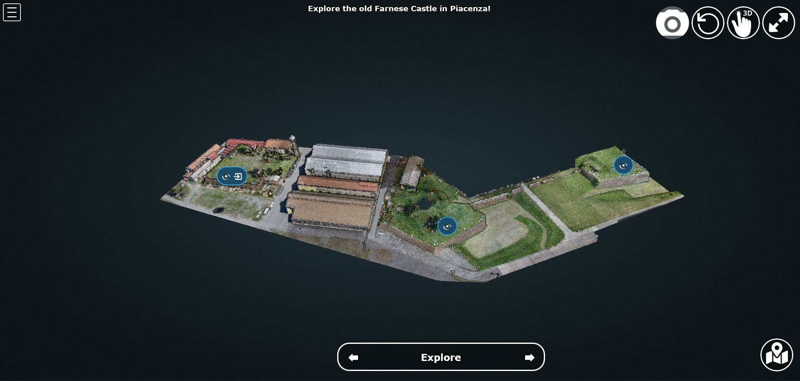
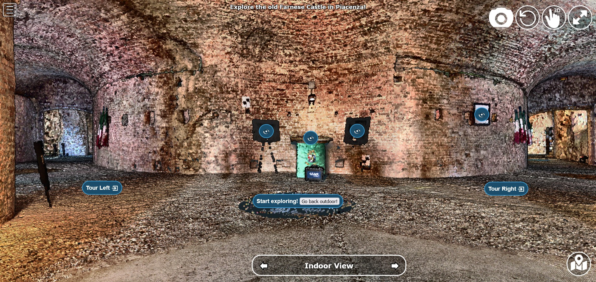
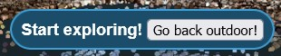
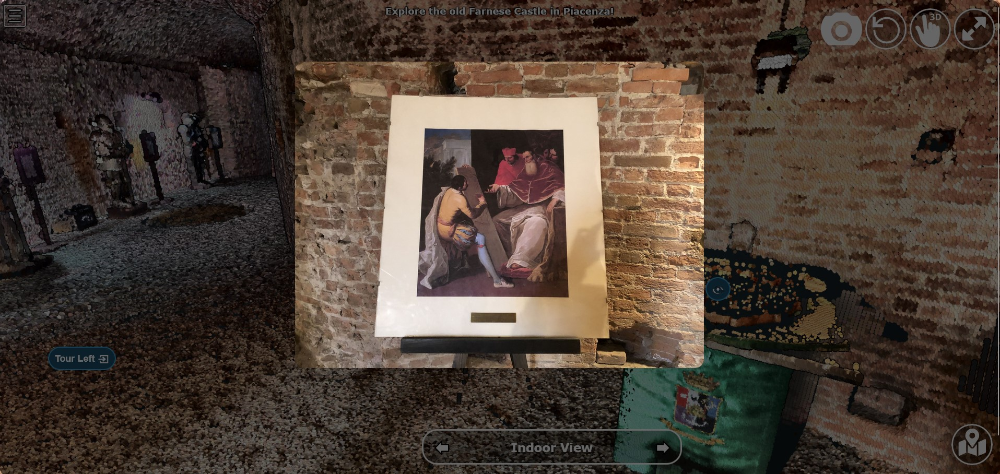

Platform implementation
=======================

[testo]

Outdoor navigation
------------------

[testo]

[testo]

Hotspot views
+++++++++++++

[testo]

Moving to indoor scene
++++++++++++++++++++++

[testo]

Showing image slide-show
++++++++++++++++++++++++

[testo]

Indoor navigation
-----------------

The exploration of the 3D reconstruction of the indoor portion of Bastione San Giacomo was defined through a series of actions included into annotations.

In particular, the following actions were implemented:

* Changing view and scene;
* Showing image pop-up;
* Playing animations.

Changing view and scene
+++++++++++++++++++++++

This action is implemented in the *Start exploring!* annotation located in the center of the entrance.
Its goal is to trigger the movement from the indoor environment to the outdoor scene.

In order to do so, an input button element is defined in the annotation name.
Then, the action is defined by defining the series of operations to be executed when the button whose name is "outdoor" is clicked by the user.

..

This event will first call the function *changeHotspotName()*, changing the hotspot name to the one of the reference point of interest on which the new scene will be focused.
In this case, it will be the outdoor of the San Giacomo bastion. So, the name to be included within the brackets is "San Giacomo".

Hence, the *moveHere()* method of the Annotation class is applied to the third element ([2]) of the annotation list defined in the *loadannotations.js* file.
In this case, it was needed to switch to the camera view defined in the Bastione San Giacomo annotation that was defined as the third in the js file.
By applying this method, the new view will automatically be set considering the coordinates and orientations included in the referred annotation.

Eventually, the visibility of annotations is changed according to the new view.
Consequently, the visible property of all the annotation children defined inside the bastion is set to *false*, while the one of the new outdoor scene annotations is changed to *true*.

.. code-block:: html

    ...
  {
    // Indoor
    let Titolo4 = $('Start exploring! <input type="button" name="outdoor" value="Go back outdoor!"/> ')
    Titolo4.find("input[name=outdoor]").click((event) => {
        event.stopPropagation();
        changeHotspotName("San Giacomo");
        scenears.annotations.children[2].moveHere(scenears.camera);
        scenears.annotations.children[0].visible = true;
        scenears.annotations.children[1].visible = true;
        scenears.annotations.children[2].visible = true;
        scenears.annotations.children[3].visible = false;
        scenears.annotations.children[4].visible = false;
        scenears.annotations.children[5].visible = false;
        scenears.annotations.children[6].visible = false;
        scenears.annotations.children[7].visible = false;
        scenears.annotations.children[8].visible = false;
        scenears.annotations.children[9].visible = false;
        scenears.annotations.children[10].visible = false;
        scenears.annotations.children[11].visible = false;
        scenears.annotations.children[12].visible = false;
        scenears.annotations.children[13].visible = false;
        scenears.annotations.children[14].visible = false;
        scenears.annotations.children[15].visible = false;
        scenears.annotations.children[16].visible = false;
    });
    Titolo4.toString = () => "Start exploring!";
    let nota4 = new Potree.Annotation({
        position: [553471.056, 4988913.293, 95.054],
        title: Titolo4,
        cameraPosition: [553474.7425516201, 4988912.090928567, 96],
        cameraTarget: [553471.056, 4988913.293, 96],
        description: '<b>Welcome to the indoor portion of the San Giacomo rampart!</b> ---- This space is the site of a permanent exhibition of historic cartography and documents about the evolution of the city of Piacenza. You can start exploring the two wings of this space by clicking on the <i>"Tour Right"</i> and <i>"Tour Left"</i> annotations. The indoor point cloud has been completely acquired through TLS scans with a CAM2 Focus M70.'
    })
    nota4.visible = false;
    scenears.annotations.add(nota4);

  }

...

"""""""""""""""""""""""""""""""""""""""""""""""

Showing image pop-up
++++++++++++++++++++

The orbit icon included in the indoor annotations is associated to an image detail.
Indeed, after clicking on it, the platform shows a pop up with the image attached to the annotation of interest.
To return to the navigation scene, the user could simply click on the faded area outside the shown image.

This action is firstly prepared by definind a div element in the *index.html* page: it will be the panel that will appear in the middle of the screen when the annotation is clicked.
Inside it, an images tag is defined with the link to the source file path of the image that will be included in the panel when visible.

.. code-block:: html

  <!--Paolo III print-->
        

            

                

                    
                

            

        

"""""""""""""""""""""""""""""""""""""""""""""""

The style for the panel - with rounded corner and position settings - is instead defined in the *assets/css/style.css* file.

.. code-block:: css

  .navPanel-content {
    margin: auto;
    padding: 20px;
    width: 80%;
    border-radius: 20px;
    position: absolute;
    left: 9%;
    text-align: center;
  }

"""""""""""""""""""""""""""""""""""""""""""""""

Finally, the annotation is defined with its title and action.
The latter one is implemented by including the orbit control icon in the annotation title: this img tag will be the one looked for by the *find()* method in the next line.
In this way, the click event will first set the camera view in correspondence of the annotation clicked.
Then, the div #anno8 previously defined is retrieved and the *.fadeIn()* method is applied to it.
In this way, the panel will gradually appear in the middle of the screen and the Potree scene below will appear more opaque.
Similarly, a new click event on the window will trigger the *.fadeOut()* method applied to the same div element.
Finally, the annotation panel will disappear and the view will return to the previous Potree scene.

.. code-block:: js

    {
        // Paolo III print
        let Titolo16 = $(`
            
                
            
        `);
        const elAnno10 = Titolo16.find("img[name=anno_panel8]");
        elAnno10.click(() => {
            scenears.annotations.children[15].moveHere(scenears.camera);
            $("#anno8").fadeIn();
            parentWin = window.parent;
            var sidebar = parentWin.document.getElementById('split-container');
            sidebar.style.opacity = "0.2";
        });
        var annoPanel8 = document.getElementById('anno8');
        annoPanel8.addEventListener('click', function () {
            $("#anno8").fadeOut();
            //reset opacity of parent page
            parentWin = window.parent;
            var sidebar = parentWin.document.getElementById('split-container');
            sidebar.style.opacity = "1";
        });
        Titolo16.toString = () => "Paolo II print";
        let nota16 = new Potree.Annotation({
            position: [553468.173, 4988913.334, 96.274],
            title: Titolo16,
            cameraPosition: [553470.5484979739,4988913.944287285,97.04518532773058],
            cameraTarget: [553468.173, 4988913.334, 96.274],
            description: '<b>Paolo II print</b> ---- The Pope is shown seated and flanked by Cardinal Alessandro Farnese as he approves the plan of the castle of Piacenza. The plan is presented to him by Pierluigi, who is kneeling, and is dressed in yellow and blue and has a white mantle. Architecture can be glimpsed in the background. Original paint from 1685 - 1687 by Sebastiano Ricci, preserved at the Civic Museum of the Farnese Palace (Piacenza). ---- '
        })
        nota16.visible = false;
        scenears.annotations.add(nota16);
    }

  ...

"""""""""""""""""""""""""""""""""""""""""""""""

Playing animations
++++++++++++++++++

In the indoor exploration, 2 animations are implemented for navigating the right and left wing of the reconstructed model.
This type of action could be helpful for defining a pre-fixed user exploration path and consequently changing the visibility of some particular annotations depending on exploration positions.

.. raw:: html
  
  <video controls src="..\_static\animation-annotation.mp4" width="400"></video>

"""""""""""""""""""""""""""""""""""""""""""""""

First, the definition of the animation is set in *assets/js/loadanimations.js*.
This is done by initially creating the animation object, then defining the camera and targets positions.
An easy way to achieve so is to navigate the model and, one the desired view for a camera animation node is found, export the Potree scene information by clicking on the sidebar *Scene>Export: Potree*.
In the downloaded *potree.json* file, it will be possible to copy the coordinates of the camera and target position of that specific view.
Then, those values can be pasted respectively in the position and target lists as shown in the script example below.
By defining multiple camera and target positions as explained before, it will be possible to create an equal amount of view point that will be interpolated when the animation play action is triggered.
This type of process is explained in the code through a for loop that creates as many animation nodes (control points) as there are camera and target positions defined.

After that, the animation is added as an object of the scene through the *.addCameraAnimation()* method and its visibility is set to false so that the associated colored trajectory line remains hidden.

.. code-block:: js

  const animation2 = new Potree.CameraAnimation(viewer);
  const positions2 = [
    [553471.5649587561, 4988912.824383096, 96.74929992934102],
    [553470.8266211117, 4988920.956978676, 96.96684674759675],
    [553468.970057797, 4988925.671973037, 96.93937869520164],
    [553466.3895679122, 4988928.694618191, 96.67629091896133],
    [553464.5111995947, 4988930.979751398, 96.70556033095784]
  ];
  
  const targets2 = [
    [553470.899, 4988918.329, 95.915],
    [553470.7600219863, 4988921.507467228, 96.832169690892],
    [553468.7403491414, 4988926.177655794, 96.80849752652905],
    [553465.620604052, 4988930.300358385, 96.4827080923057],
    [553464.0111806979, 4988932.023884267, 96.57968306104952]
  ];
  
  for (let i = 0; i < positions2.length; i++) {
    const cp = animation2.createControlPoint();

    cp.position.set(...positions2[i]);
    cp.target.set(...targets2[i]);
  }
  
  scenears.addCameraAnimation(animation2);
  animation2.visible = false;

""""""""""""""""""""""""""""""""""

Once the animation is defined, it's time to set how it should be triggered through a click event on the Potree scene.
This again results in the use of an icon and of the *find()* method.
When the icon is clicked, the animation is then activated thorugh the line *animation2.play()*.
In the same code block, the visibility of the desired annotation is changed according to the developer needs.

.. code-block:: js

  {
    // Tour Right
    let Titolo6 = $(`
                
                    Tour Right
                    
                    
                    
                `);
    const elPlay2 = Titolo6.find("img[name=action_set_animation2]");
    elPlay2.click(() => {
        animation2.play();
        scenears.annotations.children[12].visible = true;
        scenears.annotations.children[14].visible = true;
    });
    Titolo6.toString = () => "Tour Right";
    let nota6 = new Potree.Annotation({
        position: [553470.899, 4988918.329, 94.915],
        title: Titolo6,
        cameraPosition: [553471.5649587561, 4988912.824383096, 96.74929992934102],
        cameraTarget: [553470.899, 4988918.329, 95.915],
        description: 'Click on the icon and walk through the indoor left wing of the bastion... ---- You may discover a <b>secret passage</b>!'
    })
    nota6.visible = false;
    scenears.annotations.add(nota6);
  }

""""""""""""""

.. note::
  Another useful tip to facilitate user pre-fixed movements and explorations with the model scene is to position an annotation at the end of the animation path that includes an action allowing to return to the initial scene view, as the example view.

.. raw:: html
  
  <video controls src="..\_static\animation-annotation-tip.mp4" width="400"></video>

