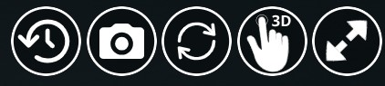
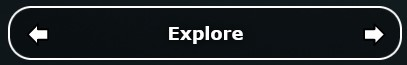

Platform implementation
=======================

The platform, based on Potree native functions and proposed modifications of the Vizcaya museum project, aims to simplify the exploration of a 3D digital model of a cultural heritage site.
With this goal, the implementation focused on the definition of simple and easy-to-reproduce functionalities that could guide even non-experienced users through the inspected and reconstructed structure.
This has been achieved using a combination of:

* **Annotation actions** triggered by the user click on a given hotspot inside the 3D scene;
* **Camera animations** that allow to explore a given scene using a pre-defined navigation path;
* **Pop-up windows** that make possible to see in more detailes images or to include text contents;
* **Shortcut buttons** used to simplify into a single command more operations.

The work has been articulated on 2 different perspectives, dividing the entire model into 2 scenes:

1. **Outdoor scene** referring to the outside of the 3 surveyed bastions of the castle, for which drones were adopted in addition to total station and GNSS antennas;
2. **Indoor scene** of the only bastion (San Giacomo one) which was accessible at the moment of the survey and that was subject to a laser scanner survey.

Control icons
------------------

Due to their peculiarities inherited by survey methods and instrumentation too, the 2 scenes require the implementation of 2 distinct groups of navigation solutions to better fit their needs.
However, some useful common functionalities have been mantained for both scenes.
In particular, the main structure of the viewer has been designed to always mantain visible 4 commands:

* **Oriented images** (*camera_icon*) visibility control;
* **Refresh page** (*refresh_icon*) option;
* **Navigation instructions** (*question_icon*) command;
* **Full screen view** (*fullscreen_icon*) button.

All these buttons, positioned on the upper right position of the screen and thought as shortcuts for common operations.

Their style and appearances have been defined as the following example in the *assets/css/style.css* file:

.. code-block:: css

  #refresh_icon {
    /*display: none;*/
    width: 80%;
    height: 80%;
    position: fixed;
    top: 15px;
    right: 160px;
    /*130px*/
    cursor: pointer;
    max-height: 70px !important;
    max-width: 70px !important;
    z-index: 2;
    background: rgba(0, 0, 0, 0.3);
    border-radius: 35px;
  }

Then, the control icons (and their image logos) have been included in the body section of the *index.html* file as follow, linking each button to a specific custom function triggered by the user click:

.. code-block:: html

  ...
  <!--Control Icons-->
  
  
  
  
  ...

Then, each function has been defined.

Oriented images visibility
++++++++++++++++++++++++++

This button is needed to have a easy-to-use shortcut for hiding or making visible all the loaded oriented images on the model.
By default, as understandable by checking the *assets/js/loadphotos.js* file, all the images are hidden to have a cleaner view of the model at first loading.
However, the click on the camera icon make them visible by triggering the following function included at the end of the *index.html* that switch the visibility conditions of all the loaded images chunks:

.. code-block:: js

  $("#camera_icon").click(function () {
    console.log('Hai cliccato sulla camera');
    viewer.scene.orientedImages[0].visible = !viewer.scene.orientedImages[0].visible;
    viewer.scene.orientedImages[1].visible = !viewer.scene.orientedImages[1].visible;
    viewer.scene.orientedImages[2].visible = !viewer.scene.orientedImages[2].visible;
  });

Refresh page
++++++++++++

This icon is simply linked to the **refreshButton()** function included in the *assets/js/main.js*:

.. code-block:: js

  function refreshButton() {
    window.top.location.reload();
  }

Navigation instructions
+++++++++++++++++++++++

The *question_icon* is the first example of pop-up panel implementation in the model, used also for some features of the outdoor and indoor navigation.
In this case, the click of the user makes visible the panel containing all the instruction for the rotation and translation of the model using both a mouse or touch commands.
These information are contained in an image embedded in a div element defined at the beggining of the *index.html*:abbr:

.. code-block:: html

  <!-- Navigation Instructions -->
  

    

      

        
      

    

  

Then, at the end of the same file, the function that change the visibility of the instruction panel is defined:

.. code-block:: js

  $("#question_icon").click(function () {
    //The panel is made visible
    $("#nav_panel").fadeIn();
    //Applying opacity to parent page
    parentWin = window.parent;
    var sidebar = parentWin.document.getElementById('split-container');
    sidebar.style.opacity = "0.5";
  });

  var navPanel = document.getElementById('nav_panel');
  // Instructions for when the panel is already visible
  navPanel.addEventListener('click', function () {
    //The panel is hidden
    $("#nav_panel").fadeOut();
    //reset opacity of parent page
    parentWin = window.parent;
    var sidebar = parentWin.document.getElementById('split-container');
    sidebar.style.opacity = "1";
  });

Fullscreen mode
+++++++++++++++++

In this case, the function has been defined in the *assets/js/main.js* file.
It is based on a series of conditions that check if the current view of the platform is already fullscreen and, based on that information, define if the click on the button will exit or enter the fullscreen mode for the user.

.. code-block:: js

  function toggleFullScreen() {
    if ((document.fullScreenElement && document.fullScreenElement !== null) ||
        (!document.mozFullScreen && !document.webkitIsFullScreen)) {
        if (document.documentElement.requestFullScreen) {
            document.documentElement.requestFullScreen();
        } else if (document.documentElement.mozRequestFullScreen) {
            document.documentElement.mozRequestFullScreen();
        } else if (document.documentElement.webkitRequestFullScreen) {
            document.documentElement.webkitRequestFullScreen(Element.ALLOW_KEYBOARD_INPUT);
        }
    } else {
        if (document.cancelFullScreen) {
            document.cancelFullScreen();
        } else if (document.mozCancelFullScreen) {
            document.mozCancelFullScreen();
        } else if (document.webkitCancelFullScreen) {
            document.webkitCancelFullScreen();
        }
    }
  }

Outdoor navigation
------------------

[testo]

.. image:: IMG/outdoor-navigation.jpg
  :align: center
  :alt: Outdoor view of the Arsenale 3D point cloud in the Potree viewer.

[testo]

Hotspot views
+++++++++++++

To facilitate the movements between different positions, a control bar is implemented at the bottom of the Potree basic viewer.
This element will help moving between predefined camera view linked to specific point of interests located around the point cloud.
This could be particularly helpful when the user is getting lost or confused during the exploration of the 3D product and would like to move to a more guided and familiar point of view using fixed positions associated to specific annotations.

.. raw:: html
  
  <video controls src="..\_static\outdoor-hotspots-navigation.mp4" width="400"></video>

The visible hotspot control bar is made possible by a combination of edits to the *index.html* and *assets/css/style.css* files.

In particular, first in *index.html* the following code is defined for creating the needed elements and blocks:

.. code-block:: html

  ...
  <!--Hotspots Dropup-->
  

    

      

        

      

      
<b id="hotspotName">Explore</b>

      

        

      

      

        <ul class="js-scrollable">
          <li id="li1" class="link"><a data-hotspot-target="0" title="Bastione San Giovanni">Bastione San Giovanni</a></li>
          <li id="li2" class="link"><a data-hotspot-target="1" title="Bastione San Benedetto">Bastione San Benedetto</a></li>
          <li id="li3" class="link"><a data-hotspot-target="2" title="Bastione San Giacomo">Bastione San Giacomo</a></li>
          <li id="li4" class="link"><a data-hotspot-target="3" title="Bastione San Giacomo (Indoor)">Bastione San Giacomo (Indoor)</a></li>
        </ul>
      

    

  

  ...

This code snippet define the hotspot controls container and the 3 controls inside it:

1. The Label of the annotation linked to the chosen view. At first page loading, this is set to *Explore*. Here, clicking on the text, it will be possible to select a specific hotspot view from a list.
2. The button to move to the *previous view* in the hotspot list. A left arrow icon is associated to it.
3. The button to move to the *following view* in the hotspot list. A right arrow icon is associated to it.

Then, the complete list of the available hotspots is defined using an unordered list block and associating specific target numbers to each hotspot target and name.

The CSS code referring to the appearance of these elements can be found from line 295 to line 541 in *style.css*.

Then the functionalities linked to the hotspot controls are defined in a module block at the bottom of *index.html*

First, variables are defined in order to store in one of it the target number associated to the hotspot selected from the hotspot list.

.. code-block:: js

  var src = document.referrer;
  var srcSplit = src.split("?");
  var hotSpot = parseFloat(srcSplit[1]); //0 for San Giovanni, 1 for San Benedetto, 2 for San Giacomo, 3 for Indoor

Then, a series of conditions are checked and, when the corrispondence between the clicked hotspot target number with the compared value is found, the **moveHere** function is applied to the scene, changing the view to the annotation corresponding to the clicked hotspot.

For example, for the case of Bastione San Giovanni hotspot:

.. code-block:: js
  
  ...
  // San Giovanni hotspot has target equal to 0 and it's the second annotation defined.
  if (hotSpot == 0) {
            setTimeout(function () {
                scenears.annotations.children[1].moveHere(scenears.camera);
            }, 1500);
        }
  ...

The changing of visibility of the list, appearing when clicking on *Explore* is insted defined with the following code:

.. code-block:: js

  ...
  /* Hotspots Control Dropup*/
        $("#hotspots").click(function () {
            $("#lists").toggle();

        });
  ...

Then a targeted function called **changeHotspotName()** is defined in the *assets/js/main.js* file.
Its goal is to change the *Explore* text in the control bar with the name of the clicked hotspot.

.. code-block:: js

  //Function to change Touch to HotspotName
  function changeHotspotName(newName){
  document.getElementById('hotspotName').innerHTML = newName;
  }

This function is then used inside the **item** function series, one for each listed hotspot.
Indeed, this function will change the visible text along with changing the camera view and the visibility of linked annotations.
For instance:

.. code-block:: js

  function item1() {
    changeHotspotName("San Giovanni");
    scenears.annotations.children[1].moveHere(scenears.camera);
    scenears.annotations.children[0].visible = true;
    scenears.annotations.children[1].visible = true;
    scenears.annotations.children[2].visible = true;
    scenears.annotations.children[3].visible = false;
    scenears.annotations.children[4].visible = false;
    scenears.annotations.children[5].visible = false;
    scenears.annotations.children[6].visible = false;
    scenears.annotations.children[7].visible = false;
    scenears.annotations.children[8].visible = false;
    scenears.annotations.children[9].visible = false;
    scenears.annotations.children[10].visible = false;
    scenears.annotations.children[11].visible = false;
    scenears.annotations.children[12].visible = false;
    scenears.annotations.children[13].visible = false;
    scenears.annotations.children[14].visible = false;
    scenears.annotations.children[15].visible = false;
    scenears.annotations.children[16].visible = false;
    }

Each item function is triggered by the click of the user on the associated element in the hotspot list.

.. code-block:: js

  $("#li1").click(function () {
    item1();
  });
  $("#li2").click(function () {
    item2();
  });
  $("#li3").click(function () {
    item3();
  });
  $("#li4").click(function () {
    item4();
  });

---

.. raw:: html
  
  <video controls src="..\_static\hotspot-name-function.mp4" width="400"></video>

Then, in order to enable the possibility to move between consecutive scenes it is needed to define a function list to move within using its index.
Its length (corresponding to the total number of defined hotspots) is then saved in a constant.

.. code-block:: js

  const functions = [];
  functions.push(item1);
  functions.push(item2);
  functions.push(item3);
  functions.push(item4);

  const length = functions.length;

Hence, the **.getNextIdx()** function is defined and built upon the chosen *condition* defined by the id of the clicked button: *next* for the right arrow, *prev* for the left arrow.
This function will return the next/previous id of the new scene in the hotspot list, calculating it with respect to the current hotspot view.

.. code-block:: js

  const getNextIdx = (idx = 0, length, direction) => {
    switch (direction) {
      case 'next': return (idx + 1) % length;
      case 'prev': return (idx == 0) && length - 1 || idx - 1;
      default: return idx;
    }
  }

This function is then finally adopted for implenting the **.getNewScene()** function that is the one that is actually trigger when the user clicks on the arrows icons.

.. code-block:: js
  
  let idx; // idx is undefined, so getNewScene will take 0 as default
  const getNewScene = (direction) => {
    idx = getNextIdx(idx, length, direction);
    var sceneFunction = functions[idx];
    return sceneFunction();
  }

  $("#prev").click(function () {
    getNewScene('prev');
  });

  $("#next").click(function () {
    getNewScene('next');
  });

Moving to indoor scene
++++++++++++++++++++++

In the outdoor view, annotation actions are implemented on specific locations.
In particular, an action for moving to the indoor environment of Bastione San Giacomo is implemented on the related annotation on the outside.

.. raw:: html
  
  <video controls src="..\_static\outdoor-to-indoor-view.mp4" width="400"></video>

This feature is made possible through simple addition to the `loadannotations.js <https://github.com/Tars4815/potree-chtemplate/blob/main/assets/js/loadannotations.js>`__ code.
In correspondance of the title (es. Titolo) definition, an arrow icon is inserted and named *action_set_scene*.

Then, through the *.find()* function, it is defined that, when the arrow icon is clicked, a series of operations should be executed:

1. The name in the hotspot bar positioned on the bottom of the viewer is changed to *Indoor View* using the **changeHotspotName** function defined in *index.html*.
2. The view is changed to the camera settings of the 4th annotation defined in the scene (in this example is the one at the entrance of the bastion) by applying the **.moveHere** function.
3. The visibility of all the annotations is changed according to the needs of the developer.

.. code-block:: js

  {
    // Bastione San Giacomo
    let Titolo = $(`
    
    <!---Bastione San Giacomo--->`);
    Titolo.find("img[name=action_set_name]").click((event) => {changeHotspotName("San Giacomo");});
    Titolo.find("img[name=action_set_scene]").click((event) => {event.stopPropagation();
        changeHotspotName("Indoor View");
        scenears.annotations.children[3].moveHere(scenears.camera);
        scenears.annotations.children[0].visible = false;
        scenears.annotations.children[1].visible = false;
        scenears.annotations.children[2].visible = false;
        scenears.annotations.children[3].visible = true;
        scenears.annotations.children[4].visible = true;
        scenears.annotations.children[5].visible = true;
        scenears.annotations.children[6].visible = true;
        scenears.annotations.children[7].visible = true;
        scenears.annotations.children[8].visible = false;
        scenears.annotations.children[9].visible = false;
        scenears.annotations.children[10].visible = false;
        scenears.annotations.children[11].visible = false;
        scenears.annotations.children[12].visible = false;
        scenears.annotations.children[13].visible = false;
        scenears.annotations.children[14].visible = false;
        scenears.annotations.children[15].visible = true;
        scenears.annotations.children[16].visible = true;
    });

    Titolo.toString = () => "San Giacomo";

    let nota3 = new Potree.Annotation({
        position: [553430.471, 4988914.868, 103.226],
        title: Titolo,
        cameraPosition: [553333.7713011784, 4988883.975343259, 166.10804103291153,],
        cameraTarget: [553430.471, 4988914.868, 103.226],
        description: '<b>San Giacomo Bastion</b> ---- Differently from the twin San Giovanni bastion, it has been affected by additional military intervention. Indeed, on the upper part merlons have been added while an underground shelter, adopted as bomb shelter during World War, is still present and partially accessible through a lateral external access. The indoor space is visitable.'
    });

    nota3.visible = true;
    scenears.annotations.add(nota3);
  }

""""

Showing image slide-show
++++++++++++++++++++++++

[testo]

.. raw:: html
  
  <video controls src="..\_static\outdoor-annotation-slideshow.mp4" width="400"></video>

""""""""""""""""""""""""""

[testo]

Indoor navigation
-----------------

The exploration of the 3D reconstruction of the indoor portion of Bastione San Giacomo was defined through a series of actions included into annotations.

.. image:: IMG/indoor-entry.jpg
  :align: center
  :alt: Entry of the indoor portion of San Giacomo Bastion

In particular, the following actions were implemented:

* Changing view and scene;
* Showing image pop-up;
* Playing animations.

Changing view and scene
+++++++++++++++++++++++

This action is implemented in the *Start exploring!* annotation located in the center of the entrance.
Its goal is to trigger the movement from the indoor environment to the outdoor scene.

In order to do so, an input button element is defined in the annotation name.
Then, the action is defined by defining the series of operations to be executed when the button whose name is "outdoor" is clicked by the user.

.. image:: IMG/go-back-outdoor.jpg
  :align: center
  :alt: Example of button action for changing view and scene
..

This event will first call the function *changeHotspotName()*, changing the hotspot name to the one of the reference point of interest on which the new scene will be focused.
In this case, it will be the outdoor of the San Giacomo bastion. So, the name to be included within the brackets is "San Giacomo".

Hence, the *moveHere()* method of the Annotation class is applied to the third element ([2]) of the annotation list defined in the *loadannotations.js* file.
In this case, it was needed to switch to the camera view defined in the Bastione San Giacomo annotation that was defined as the third in the js file.
By applying this method, the new view will automatically be set considering the coordinates and orientations included in the referred annotation.

Eventually, the visibility of annotations is changed according to the new view.
Consequently, the visible property of all the annotation children defined inside the bastion is set to *false*, while the one of the new outdoor scene annotations is changed to *true*.

.. code-block:: html

    ...
  {
    // Indoor
    let Titolo4 = $('Start exploring! <input type="button" name="outdoor" value="Go back outdoor!"/> ')
    Titolo4.find("input[name=outdoor]").click((event) => {
        event.stopPropagation();
        changeHotspotName("San Giacomo");
        scenears.annotations.children[2].moveHere(scenears.camera);
        scenears.annotations.children[0].visible = true;
        scenears.annotations.children[1].visible = true;
        scenears.annotations.children[2].visible = true;
        scenears.annotations.children[3].visible = false;
        scenears.annotations.children[4].visible = false;
        scenears.annotations.children[5].visible = false;
        scenears.annotations.children[6].visible = false;
        scenears.annotations.children[7].visible = false;
        scenears.annotations.children[8].visible = false;
        scenears.annotations.children[9].visible = false;
        scenears.annotations.children[10].visible = false;
        scenears.annotations.children[11].visible = false;
        scenears.annotations.children[12].visible = false;
        scenears.annotations.children[13].visible = false;
        scenears.annotations.children[14].visible = false;
        scenears.annotations.children[15].visible = false;
        scenears.annotations.children[16].visible = false;
    });
    Titolo4.toString = () => "Start exploring!";
    let nota4 = new Potree.Annotation({
        position: [553471.056, 4988913.293, 95.054],
        title: Titolo4,
        cameraPosition: [553474.7425516201, 4988912.090928567, 96],
        cameraTarget: [553471.056, 4988913.293, 96],
        description: '<b>Welcome to the indoor portion of the San Giacomo rampart!</b> ---- This space is the site of a permanent exhibition of historic cartography and documents about the evolution of the city of Piacenza. You can start exploring the two wings of this space by clicking on the <i>"Tour Right"</i> and <i>"Tour Left"</i> annotations. The indoor point cloud has been completely acquired through TLS scans with a CAM2 Focus M70.'
    })
    nota4.visible = false;
    scenears.annotations.add(nota4);

  }

...

"""""""""""""""""""""""""""""""""""""""""""""""

Showing image pop-up
++++++++++++++++++++

The orbit icon included in the indoor annotations is associated to an image detail.
Indeed, after clicking on it, the platform shows a pop up with the image attached to the annotation of interest.
To return to the navigation scene, the user could simply click on the faded area outside the shown image.

.. image:: IMG/indoor-image-pop-up.jpg
  :align: center
  :alt: Example of the image pop-up action on print.

This action is firstly prepared by definind a div element in the *index.html* page: it will be the panel that will appear in the middle of the screen when the annotation is clicked.
Inside it, an images tag is defined with the link to the source file path of the image that will be included in the panel when visible.

.. code-block:: html

  <!--Paolo III print-->
        

            

                

                    
                

            

        

"""""""""""""""""""""""""""""""""""""""""""""""

The style for the panel - with rounded corner and position settings - is instead defined in the *assets/css/style.css* file.

.. code-block:: css

  .navPanel-content {
    margin: auto;
    padding: 20px;
    width: 80%;
    border-radius: 20px;
    position: absolute;
    left: 9%;
    text-align: center;
  }

"""""""""""""""""""""""""""""""""""""""""""""""

Finally, the annotation is defined with its title and action.
The latter one is implemented by including the orbit control icon in the annotation title: this img tag will be the one looked for by the *find()* method in the next line.
In this way, the click event will first set the camera view in correspondence of the annotation clicked.
Then, the div #anno8 previously defined is retrieved and the *.fadeIn()* method is applied to it.
In this way, the panel will gradually appear in the middle of the screen and the Potree scene below will appear more opaque.
Similarly, a new click event on the window will trigger the *.fadeOut()* method applied to the same div element.
Finally, the annotation panel will disappear and the view will return to the previous Potree scene.

.. code-block:: js

    {
        // Paolo III print
        let Titolo16 = $(`
            
                
            
        `);
        const elAnno10 = Titolo16.find("img[name=anno_panel8]");
        elAnno10.click(() => {
            scenears.annotations.children[15].moveHere(scenears.camera);
            $("#anno8").fadeIn();
            parentWin = window.parent;
            var sidebar = parentWin.document.getElementById('split-container');
            sidebar.style.opacity = "0.2";
        });
        var annoPanel8 = document.getElementById('anno8');
        annoPanel8.addEventListener('click', function () {
            $("#anno8").fadeOut();
            //reset opacity of parent page
            parentWin = window.parent;
            var sidebar = parentWin.document.getElementById('split-container');
            sidebar.style.opacity = "1";
        });
        Titolo16.toString = () => "Paolo II print";
        let nota16 = new Potree.Annotation({
            position: [553468.173, 4988913.334, 96.274],
            title: Titolo16,
            cameraPosition: [553470.5484979739,4988913.944287285,97.04518532773058],
            cameraTarget: [553468.173, 4988913.334, 96.274],
            description: '<b>Paolo II print</b> ---- The Pope is shown seated and flanked by Cardinal Alessandro Farnese as he approves the plan of the castle of Piacenza. The plan is presented to him by Pierluigi, who is kneeling, and is dressed in yellow and blue and has a white mantle. Architecture can be glimpsed in the background. Original paint from 1685 - 1687 by Sebastiano Ricci, preserved at the Civic Museum of the Farnese Palace (Piacenza). ---- '
        })
        nota16.visible = false;
        scenears.annotations.add(nota16);
    }

  ...

"""""""""""""""""""""""""""""""""""""""""""""""

Playing animations
++++++++++++++++++

In the indoor exploration, 2 animations are implemented for navigating the right and left wing of the reconstructed model.
This type of action could be helpful for defining a pre-fixed user exploration path and consequently changing the visibility of some particular annotations depending on exploration positions.

.. raw:: html
  
  <video controls src="..\_static\animation-annotation.mp4" width="400"></video>

"""""""""""""""""""""""""""""""""""""""""""""""

First, the definition of the animation is set in *assets/js/loadanimations.js*.
This is done by initially creating the animation object, then defining the camera and targets positions.
An easy way to achieve so is to navigate the model and, one the desired view for a camera animation node is found, export the Potree scene information by clicking on the sidebar *Scene>Export: Potree*.
In the downloaded *potree.json* file, it will be possible to copy the coordinates of the camera and target position of that specific view.
Then, those values can be pasted respectively in the position and target lists as shown in the script example below.
By defining multiple camera and target positions as explained before, it will be possible to create an equal amount of view point that will be interpolated when the animation play action is triggered.
This type of process is explained in the code through a for loop that creates as many animation nodes (control points) as there are camera and target positions defined.

After that, the animation is added as an object of the scene through the *.addCameraAnimation()* method and its visibility is set to false so that the associated colored trajectory line remains hidden.

.. code-block:: js

  const animation2 = new Potree.CameraAnimation(viewer);
  const positions2 = [
    [553471.5649587561, 4988912.824383096, 96.74929992934102],
    [553470.8266211117, 4988920.956978676, 96.96684674759675],
    [553468.970057797, 4988925.671973037, 96.93937869520164],
    [553466.3895679122, 4988928.694618191, 96.67629091896133],
    [553464.5111995947, 4988930.979751398, 96.70556033095784]
  ];
  
  const targets2 = [
    [553470.899, 4988918.329, 95.915],
    [553470.7600219863, 4988921.507467228, 96.832169690892],
    [553468.7403491414, 4988926.177655794, 96.80849752652905],
    [553465.620604052, 4988930.300358385, 96.4827080923057],
    [553464.0111806979, 4988932.023884267, 96.57968306104952]
  ];
  
  for (let i = 0; i < positions2.length; i++) {
    const cp = animation2.createControlPoint();

    cp.position.set(...positions2[i]);
    cp.target.set(...targets2[i]);
  }
  
  scenears.addCameraAnimation(animation2);
  animation2.visible = false;

""""""""""""""""""""""""""""""""""

Once the animation is defined, it's time to set how it should be triggered through a click event on the Potree scene.
This again results in the use of an icon and of the *find()* method.
When the icon is clicked, the animation is then activated thorugh the line *animation2.play()*.
In the same code block, the visibility of the desired annotation is changed according to the developer needs.

.. code-block:: js

  {
    // Tour Right
    let Titolo6 = $(`
                
                    Tour Right
                    
                    
                    
                `);
    const elPlay2 = Titolo6.find("img[name=action_set_animation2]");
    elPlay2.click(() => {
        animation2.play();
        scenears.annotations.children[12].visible = true;
        scenears.annotations.children[14].visible = true;
    });
    Titolo6.toString = () => "Tour Right";
    let nota6 = new Potree.Annotation({
        position: [553470.899, 4988918.329, 94.915],
        title: Titolo6,
        cameraPosition: [553471.5649587561, 4988912.824383096, 96.74929992934102],
        cameraTarget: [553470.899, 4988918.329, 95.915],
        description: 'Click on the icon and walk through the indoor left wing of the bastion... ---- You may discover a <b>secret passage</b>!'
    })
    nota6.visible = false;
    scenears.annotations.add(nota6);
  }

""""""""""""""

.. note::
  Another useful tip to facilitate user pre-fixed movements and explorations with the model scene is to position an annotation at the end of the animation path that includes an action allowing to return to the initial scene view, as the example view.

.. raw:: html
  
  <video controls src="..\_static\animation-annotation-tip.mp4" width="400"></video>

